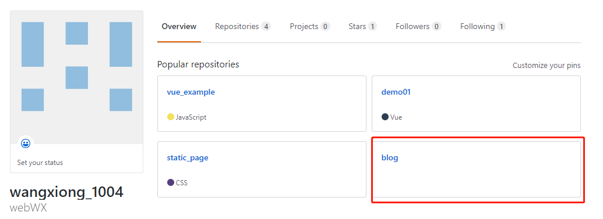
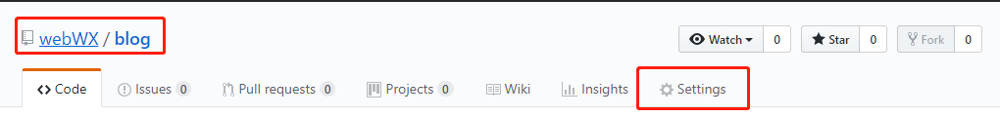
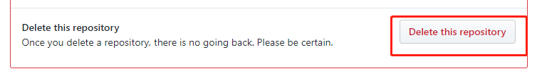
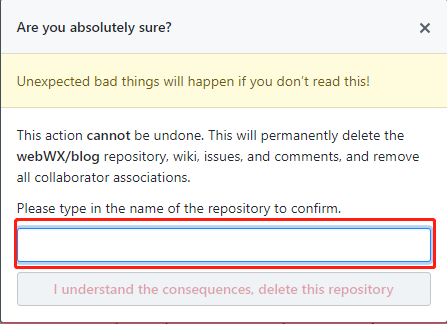
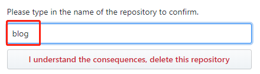
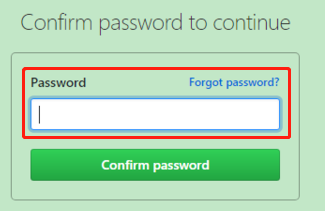
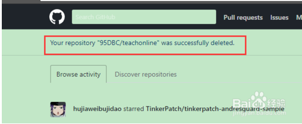

# 如何删除GitHub项目

- 首先找到你要删除的项目，点开

- 然后找到Settings

- 将滚动条滑至底部，找到 Danger Zone 下的 Delete this repository

- 这里会弹出一个警告对话框

- 将该项目名称重新输一遍即可

- 这里会弹出账号重新确认，将密码在输入一遍确认即可

- 删除成功后，重新回个人主界面会提醒，项目删除成功

